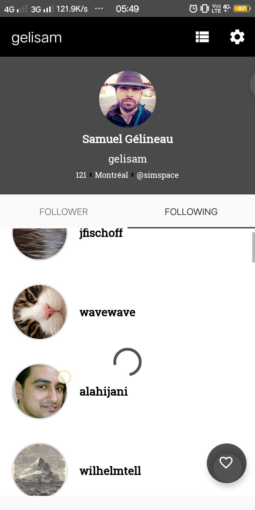
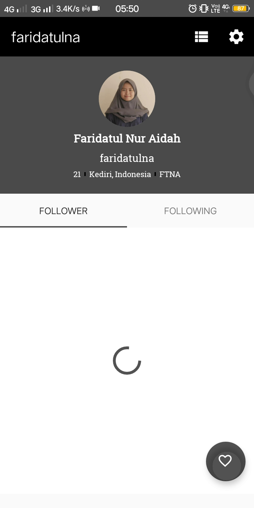
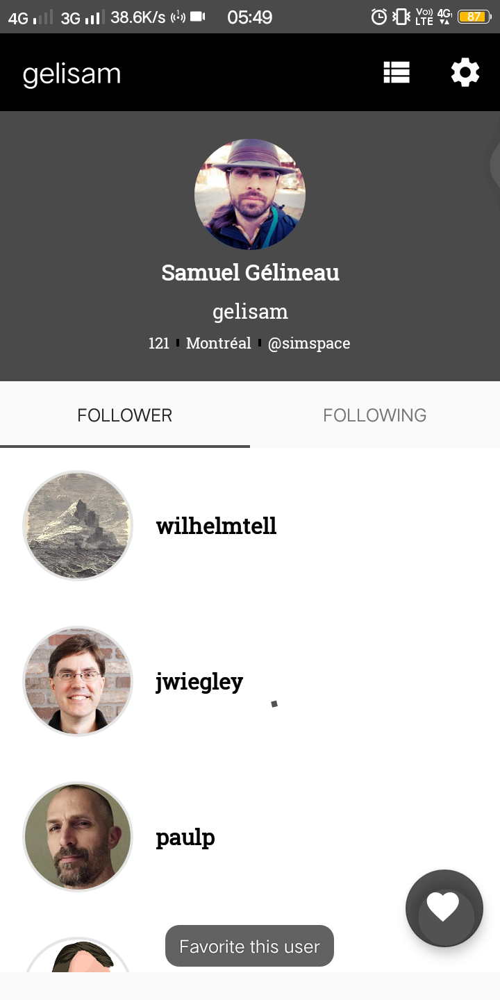
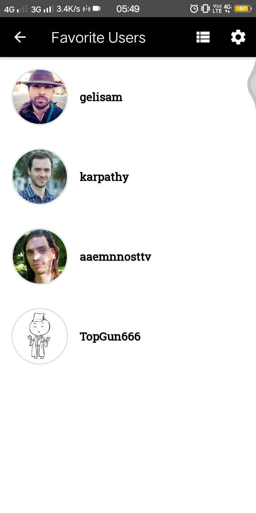
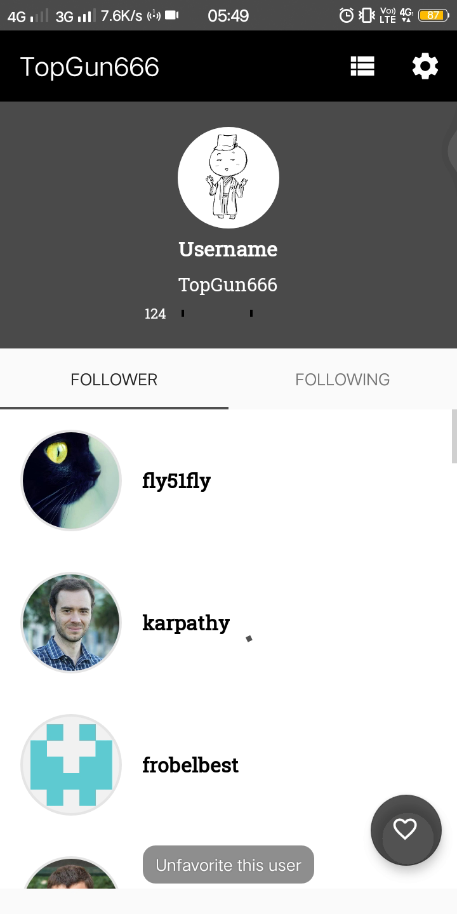
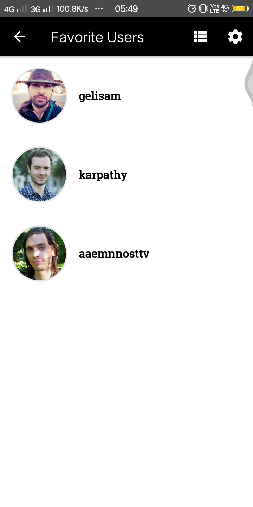
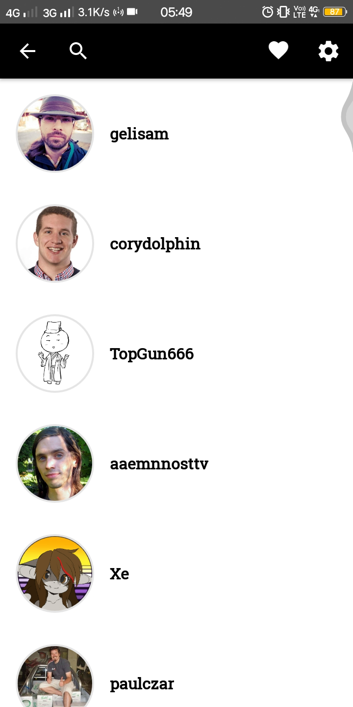
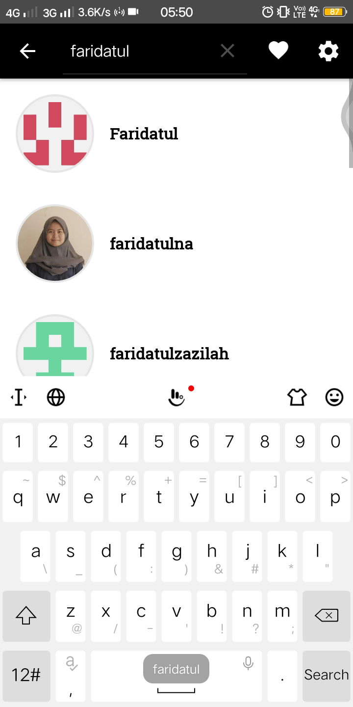
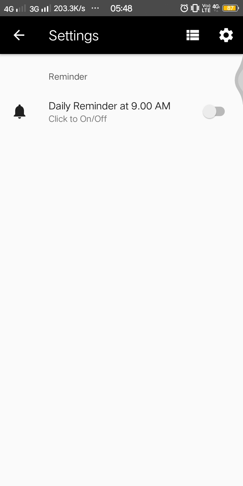
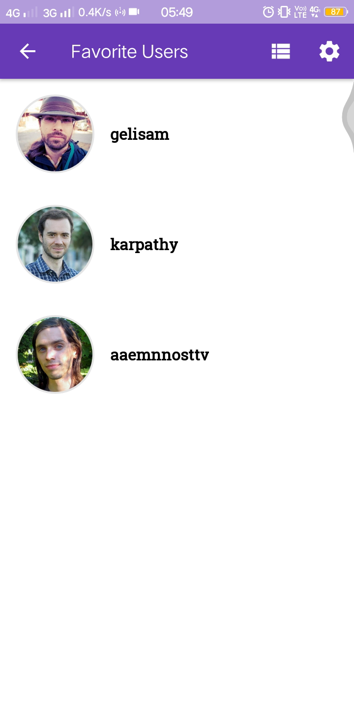

# Dicoding Submission - GitHub User
A mobile apps that displays a list of users on GitHub along with their details. The data used is public data from GitHub API.
This repository is the result of learning from [Dicoding](https://www.dicoding.com/) class [Learn Fundamental Android Application](https://www.dicoding.com/academies/14).

## Installation
Clone this repository then import into android Studio

## Features
+ View GitHub user list
+ View GitHub user detail profile
+ Favorite/UnFavorite GitHub user
+ View favorite GitHub user
+ Consumer apps of favorite GitHub user
+ Reminder Preferences

## Documentation
<h3 align="center"> User View </h3>

    

<h3 align="center"> Detail User View </h3>

    
    

<h3 align="center"> Favorite User View </h3>

  
    
    
    

   

<h3 align="center"> Search View </h3>

    
    

<h3 align="center"> Notification Reminder </h3>

    

           

<h3 align="center"> Consumer App </h3>

    
    

## Tools and Dependencies
+ Android Studio, Kotlin
+ Retrofit2
+ LoopJ
+ Okhttp3
+ RecyclerView
+ MaterialDesign
+ KotilnxCoroutine
+ Glide

## Author
[**Faridatul Nur Aidah**](https://www.linkedin.com/in/faridatulna/) - fnuraidah990@gmail.com
